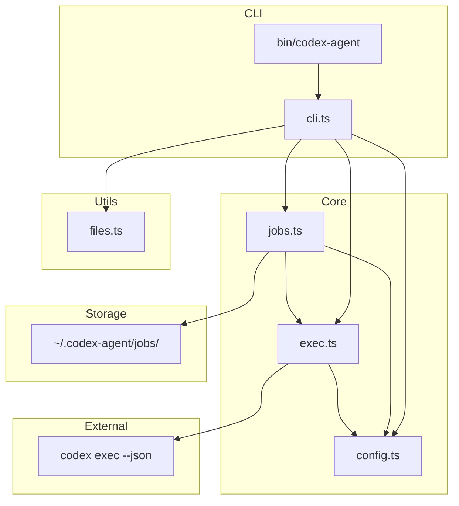
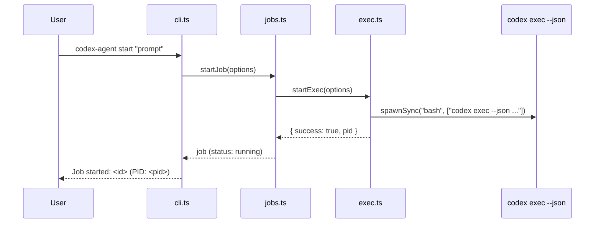
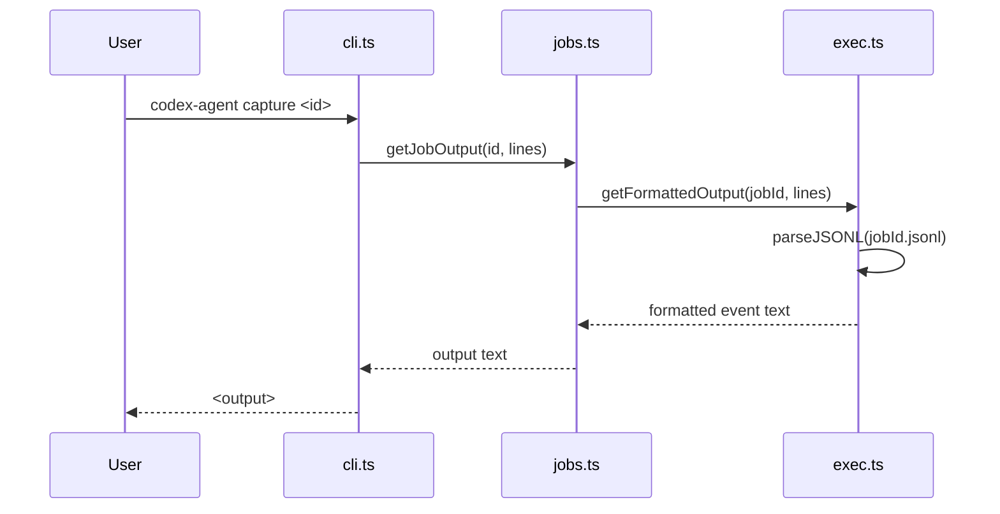

# Codebase Map

> Updated: 2026-02-15

## System Overview

CLI tool for delegating tasks to GPT Codex agents via `codex exec --json`. Designed for Claude Code orchestration. Cross-platform (macOS, Linux, Windows).



## Directory Structure

```
codex-agent/
├── bin/
│   └── codex-agent      # Shell wrapper
├── src/
│   ├── cli.ts           # Main CLI entry point
│   ├── config.ts        # Configuration constants
│   ├── exec.ts          # codex exec --json process management
│   ├── files.ts         # File loading utilities
│   └── jobs.ts          # Job lifecycle management
├── docs/
│   └── CODEBASE_MAP.md  # This file
├── .gitignore
└── package.json
```

## Module Guide

### bin/codex-agent

**Purpose**: Shell wrapper to execute TypeScript CLI with Bun runtime

**Key Logic**: Resolves script directory dynamically, passes all args to cli.ts

---

### src/config.ts

**Purpose**: Central configuration and type definitions

**Exports**:
| Export | Type | Description |
|--------|------|-------------|
| `config` | object | All configuration constants |
| `ReasoningEffort` | type | "low" \| "medium" \| "high" \| "xhigh" |
| `SandboxMode` | type | "read-only" \| "workspace-write" \| "danger-full-access" |

**Key Values**:
- `model`: "gpt-5.3-codex"
- `jobsDir`: `~/.codex-agent/jobs`
- `defaultTimeout`: 60 minutes

---

### src/files.ts

**Purpose**: File loading utilities for context injection into prompts

**Exports**:
| Export | Description |
|--------|-------------|
| `loadFiles(patterns, baseDir)` | Load files matching glob patterns |
| `estimateTokens(text)` | Rough token count (~4 chars/token) |
| `formatPromptWithFiles(prompt, files)` | Inject files as markdown code blocks |
| `loadCodebaseMap(cwd)` | Find CODEBASE_MAP.md or ARCHITECTURE.md |

**Dependencies**: `glob` npm package

**Filters Applied**:
- Skip binary files (null byte detection)
- Skip files > 500KB
- Deduplicate matches
- Support negation patterns (!)

---

### src/exec.ts

**Purpose**: codex exec --json process management

**Exports**:
| Export | Description |
|--------|-------------|
| `startExec(options)` | Spawn `codex exec --json` as detached background process |
| `isRunning(pid)` | Check if process is alive via `process.kill(pid, 0)` |
| `killProcess(pid)` | Terminate process via SIGTERM |
| `getStoredPid(jobId)` | Read PID from `.pid` file |
| `parseJSONL(filePath)` | Parse JSONL file into typed events |
| `getEvents(jobId, lines?)` | Get recent JSONL events |
| `getAllEvents(jobId)` | Get all JSONL events |
| `getLastEvent(jobId)` | Get most recent event |
| `getFormattedOutput(jobId, lines?)` | Format events for display |
| `formatEvent(event)` | Format single event for display |
| `detectCompletion(jobId)` | Check JSONL for completion/failure events |
| `extractFilesModified(events)` | Extract file_change events |
| `extractTokenUsage(events)` | Extract token counts from turn events |
| `isCodexAvailable()` | Check if codex CLI is installed |
| `getCodexVersion()` | Get codex CLI version string |

**Key Behaviors**:
- Uses Node `spawnSync` with shell-level background process and file-based stdout/stderr
- JSONL output streams to `<jobId>.jsonl`
- PID stored in `<jobId>.pid` for cross-platform liveness checks
- Fire-and-forget execution model (no mid-task messaging)

---

### src/jobs.ts

**Purpose**: High-level job lifecycle and persistence

**Exports**:
| Export | Description |
|--------|-------------|
| `Job` | Interface for job metadata |
| `startJob(options)` | Create and start new job |
| `loadJob(id)` | Load job from storage |
| `saveJob(job)` | Persist job to JSON |
| `listJobs()` | List all jobs (sorted by date) |
| `deleteJob(id)` | Delete job and cleanup |
| `killJob(id)` | Forcefully terminate |
| `getJobOutput(id, lines?)` | Get recent output |
| `getJobFullOutput(id)` | Get complete output |
| `refreshJobStatus(id)` | Update status from PID/JSONL |
| `cleanupOldJobs(days)` | Remove old completed jobs |
| `getJobsJson()` | Get enriched job data for --json output |

**Job Status Lifecycle**: pending -> running -> completed | failed

**Storage**: JSON files in `~/.codex-agent/jobs/`

**Completion Detection**: JSONL events (turn.completed/turn.failed) + PID liveness + inactivity timeout

---

### src/cli.ts

**Purpose**: Main CLI entry point and command routing

**Commands**:
| Command | Description |
|---------|-------------|
| `start <prompt>` | Start new agent job |
| `status <id>` | Show job details |
| `capture <id> [lines]` | Get recent output (default: 50) |
| `output <id>` | Get full session output |
| `events <id>` | View parsed JSONL events |
| `watch <id>` | Stream output updates |
| `jobs` | List all jobs |
| `kill <id>` | Terminate job |
| `clean` | Remove jobs older than 7 days |
| `delete <id>` | Delete specific job |
| `health` | Check codex availability |

**Options**:
| Option | Description |
|--------|-------------|
| `-r, --reasoning` | low, medium, high, xhigh |
| `-m, --model` | Model name |
| `-s, --sandbox` | read-only, workspace-write, danger-full-access |
| `-f, --file` | Include files (glob, repeatable) |
| `-d, --dir` | Working directory |
| `--map` | Include codebase map |
| `--json` | Output JSON (jobs command) |
| `--limit <n>` | Limit jobs shown (default: 20) |
| `--all` | Show all jobs |
| `--parent-session <id>` | Parent session ID |
| `--dry-run` | Preview without executing |

---

## Data Flow

### Job Creation



### Output Retrieval



## Storage Structure

```
~/.codex-agent/jobs/
├── <jobId>.json        # Job metadata (status, model, timestamps, pid)
├── <jobId>.prompt      # Original prompt text
├── <jobId>.jsonl       # JSONL event stream from codex exec --json
├── <jobId>.stderr      # Stderr output
└── <jobId>.pid         # Process ID file
```

## Conventions

- **Job IDs**: 8 random hex characters (4 bytes)
- **Output**: JSONL event stream parsed for display
- **Completion detection**: JSONL events + PID liveness + inactivity timeout
- **Cross-platform**: Uses `process.kill(pid, 0)` for liveness checks, no Unix-specific dependencies

## Gotchas

1. **Concurrent sessions**: Multiple `codex exec` instances may interfere with session restore (use `--ephemeral` if needed)
2. **Fire-and-forget**: No mid-task messaging; agents must have self-contained tasks
3. **JSONL buffering**: Output may buffer differently across platforms
4. **Log files**: May contain ANSI terminal codes (use `--strip-ansi`)

## Navigation Guide

**To add a new CLI command**:
- Add case in `src/cli.ts` switch statement
- Add help text to HELP constant

**To change default config**:
- Edit `src/config.ts`

**To modify job storage**:
- Edit `src/jobs.ts` (save/load functions)

**To change execution behavior**:
- Edit `src/exec.ts` (startExec for spawning, parseJSONL for output parsing)

**To add file filtering**:
- Edit `src/files.ts` (loadFiles function)
